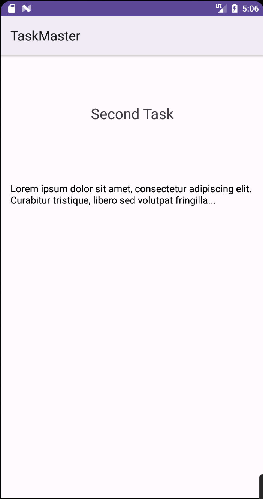

# TaskMaster Lab Series Main Readme/TOC

* [Lab 26: Taskmaster Initial](#class-26-is-the-initial-buildout-which-had-the-following-requirements-)
* [Lab 27: Adding Data](#class-27--adding-data-lab)
* [Lab 28: RecyclerViews](#class-28--recyclerviews)

## Description

This is an application which will evolve over time as a "To Do List" program that uses different 
data storage and hosting methods and adds components and functionality over time.

### Instructions

In order to run the application, you must run it through an Android Emulator. 
It was constructed using a Pixel 3a XL emulator with a minimum android API 24 and target of 33.

## Change Log

#### Class 28: RecyclerViews

1. Task Model
   * Create a Task class. A task should have:
        * Title
        * Body
        * State (new, assigned, in progress, complete)
2. Homepage
   * Refactor the homepage to use a RecyclerView for displaying Task data (hardcoded task data for now)
   * Some Steps
     * Create a ViewAdapter class that displays data from a list of Tasks.
     * In your MainActivity, create at least three hardcoded Task instances and use those to populate your RecyclerView/ViewAdapter.
   * Ensure that you can tap on any one of the Tasks in the RecyclerView and it will appropriately launch the detail page with the correct Task title displayed.

#### Class 27: Adding Data Lab
1. Task Details Page
   * Show the selected task's title
   * Lorem Ipsum that description
2. Settings Page
   * Inpute field for Username
   * save button to save the Username
3. Homepage
   * Add Username Label which starts as empty
   * Navigate to the Settings Page via button ***if the user saves their username, display it when we come back to the homepage***
   * Add 3 buttons with "task" titles (hardcoded task titles)
      * Navigate to Task Details Page send the task title
         * Title at top of page should match task selected

#### Class 26 is the initial buildout which had the following requirements:
1. Homepage
    * Title
    * Placeholder Img
    * Button::nav to All Tasks Page
    * Button::nav to Add Task Page
2. Add Task Page
   * Title
   * Input field for task name
   * Input field for task description
   * Add task button
   * "Submitted" indicator
   * Total Tasks label (non functional just present)
3. All Tasks Page
   * No Functionality
   * (Optional) Placeholder Img
   
**All these requirements were implemented**

[//]: # (## Links/Notes/Info)

## Screenshots for Lab: Class 28

 
 

### Idiot's guide (Meaning me.. So I don't forget a few things) to Navigation: Important Locations

*/taskmaster*

*/app*
.gitignore: matches class example
build.gradle: matches class example

*/app/src/main*
* /java
* /res
    * drawable: images
    * layout:
      * activity_main.xml
    * values: this is where colors, strings, & themes are defined and called in activities
      * colors.xml
      * strings.xml
      * themes.xml
  
AndroidManifest.xml: where activities are added. 
* `<intent-filter>` is what defines the main activity.

*/screenshots*
* within this directory are subdirectories for each lab's screenshots

*/wireframes*
* within this directory are subdirectories for each lab's wireframe examples

Root directory: taskmaster 
Root build.gradle: currently 8.1.1
Root gradlew: Android apps require emulator, CLI gradlew does not function
Root .gitignore: matches class example

