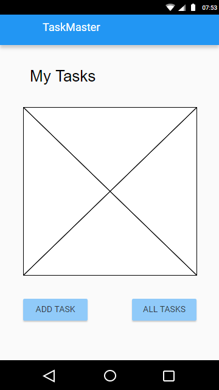
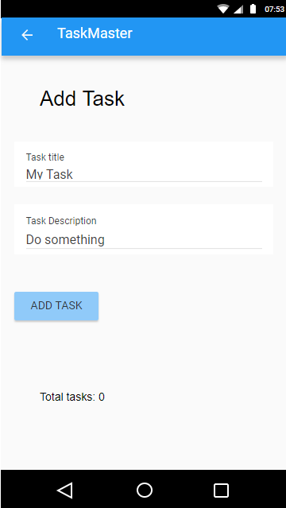
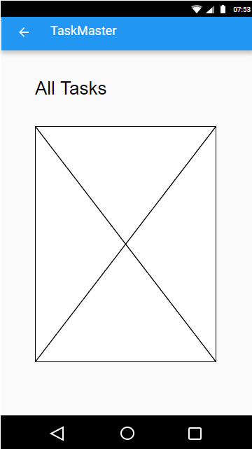

# TaskMaster Lab: Class 26 - Beginning TaskMaster

## Description
This is an application which will evolve over time as a "To Do List" program that uses different 
data storage and hosting methods and adds components and functionality over time.

### Instructions
In order to run the Class 26 version of the application, you must run it through an Android Emulator. 
It was constructed using a Pixel 3a XL emulator with a minimum android API 24 and target of 33.

## Change Log
Class 26 is the initial buildout which had the following requirements:
1. Homepage
    * Title
    * Placeholder Img
    * Button::nav to All Tasks Page
    * Button::nav to Add Task Page
2. Add Task Page
   * Title
   * Input field for task name
   * Input field for task description
   * Add task button
   * "Submitted" indicator
   * Total Tasks label (non functional just present)
3. All Tasks Page
   * No Functionality
   * (Optional) Placeholder Img
   
**All these requirements were implemented**

## Links/Notes/Info

*Resources from the Lab Assignment Materials*
[Android Buttons](https://developer.android.com/guide/topics/ui/controls/button.html)

[Android UI Events](https://developer.android.com/guide/topics/ui/ui-events.html)

*Wireframe examples provided*

## Screenshots for Lab: Class 26

### Idiot's guide (Meaning me.. So I don't forget a few things) to Navigation: Important Locations

*/taskmaster*

*/app*
.gitignore: matches class example
build.gradle: matches class example

*/app/src/main*
* /java
* /res
    * drawable: images
    * layout:
      * activity_main.xml
    * values: this is where colors, strings, & themes are defined and called in activities
      * colors.xml
      * strings.xml
      * themes.xml
  
AndroidManifest.xml: where activities are added. 
* `<intent-filter>` is what defines the main activity.

*/screenshots*
* within this directory are subdirectories for each lab's screenshots

*/wireframes*
* within this directory are subdirectories for each lab's wireframe examples

Root directory: taskmaster 
Root build.gradle: currently 8.1.1
Root gradlew: Android apps require emulator, CLI gradlew does not function
Root .gitignore: matches class example

