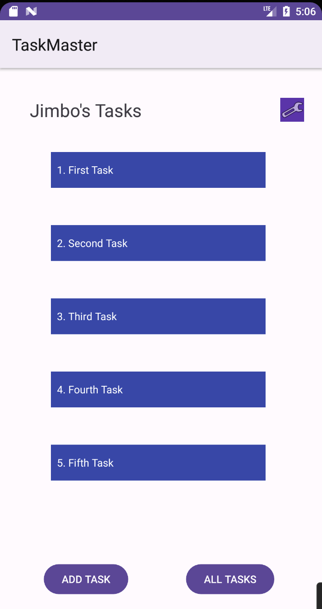
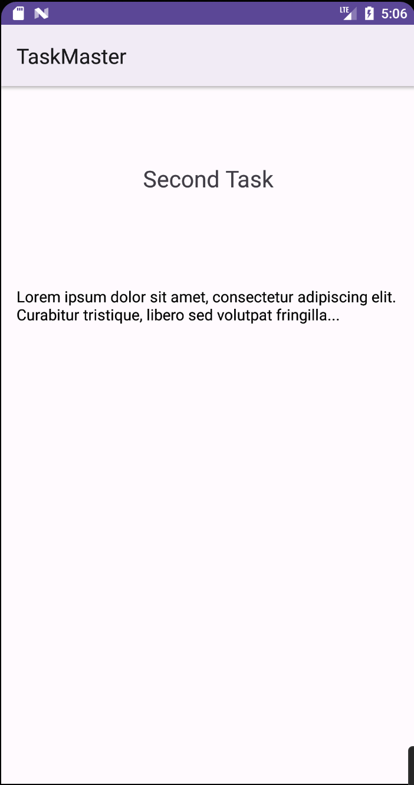

# Lab: Class 28 - RecyclerViews for Displaying Lists of Data

## Overview

Today, you’ll refactor your homepage to look snazzy, with a RecyclerView full of Task data.

## Setup

Continue working in your `taskmaster` repository.

## Resources

[RecyclerView](https://developer.android.com/guide/topics/ui/layout/recyclerview#java)

[Android Studio user guide](https://developer.android.com/studio/intro)

## Feature Tasks

### Task Model
Create a Task class. A Task should have a title, a body, and a state. The state should be one of “new”, “assigned”, “in progress”, or “complete”.

### Homepage
Refactor your homepage to use a RecyclerView for displaying Task data. This should have hardcoded Task data for now.

Some steps you will likely want to take to accomplish this:
* Create a ViewAdapter class that displays data from a list of Tasks.
* In your MainActivity, create at least three hardcoded Task instances and use those to populate your RecyclerView/ViewAdapter.
* Ensure that you can tap on any one of the Tasks in the RecyclerView, and it will appropriately launch the detail page with the correct Task title displayed.

## Documentation

Replace your homepage screenshot, and update your daily change log with today’s changes.

## Testing

In a future lecture, we’ll talk about how to test Android UI using Espresso. For now, ensure that you’re writing good unit tests for anything unit-testable in your code.

### Stretch Goals

Consider the styling for this app. Decide on a color scheme and font families to use. (You’ll thank yourself later for doing this work now!)
Allow the user to specify on their settings page how many tasks should be shown on the homepage. Use this to dynamically create as many tasks as the user requests for display in the RecyclerView.
In addition to sending the Task title to the detail page, also display the description of that task instead of the Lorem Ipsum text.

### Lab 28 Screenshots

 
 

