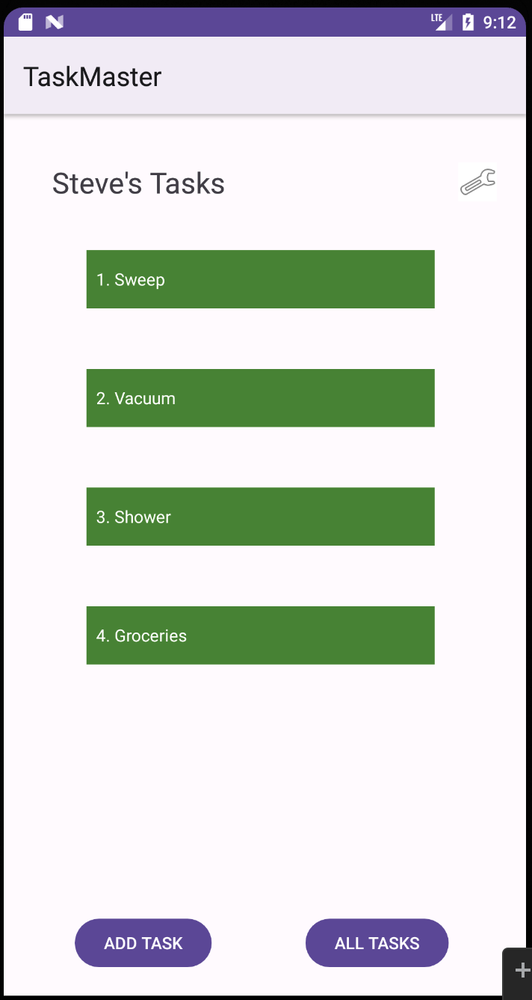

# Lab: 29 - Room: Saving Data with Room

## Overview

Today, you’ll refactor your model layer to store Task data in a local database.

## Setup

Continue working in your `taskmaster` repository.

## Resources
* [Overview: Saving data with Room](https://developer.android.com/training/data-storage/room)
* [Android Studio user guide](https://developer.android.com/studio/intro)

## Feature Tasks

### Task Model and Room

Following the directions provided in the Android documentation, set up Room in your application, and modify your Task class to be an Entity.

### Add Task Form

Modify your Add Task form to save the data entered in as a Task in your local database.

### Homepage

Refactor your homepage’s RecyclerView to display all Task entities in your database.

### Detail Page

Ensure that the description and status of a tapped task are also displayed on the detail page, in addition to the title. (Note that you can accomplish this by passing along the entire Task entity, or by passing along only its ID in the intent.)

## Documentation

Update your daily change log with today’s changes.

## Testing

Ensure that you have used Espresso to test relevant functionality of your application; for instance, tap on an item on the My Tasks page, and ensure that the correct details are rendered on the Detail page.

### Stretch Goals

* Allow the user to specify on their settings page how many tasks should be shown on the homepage. Use this to dynamically display as many tasks as the user requests for display in the RecyclerView.
* Allow the user to specify on their settings page how the tasks should be sorted (by title, status, or creation time).

## Screenshots for Lab: Class 29

 
 
