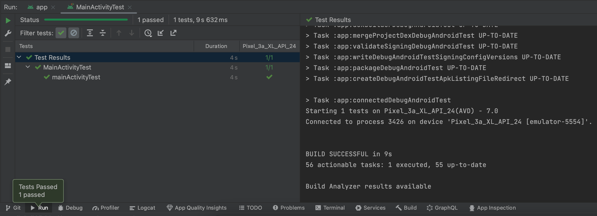
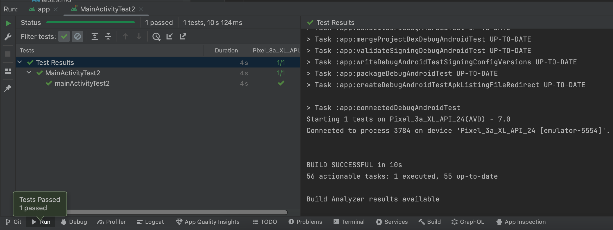
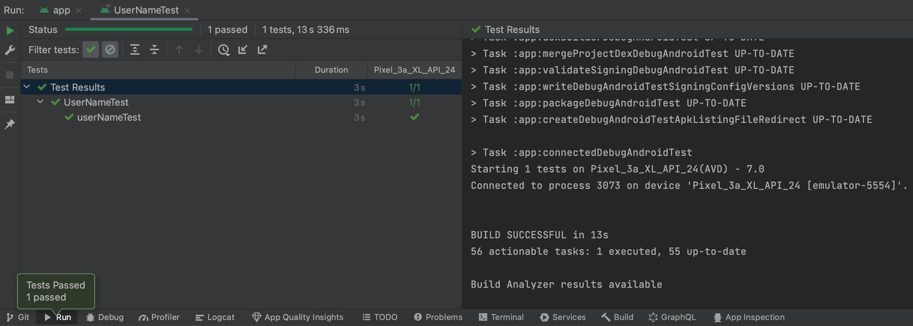

# Lab 31: Testing Views with Espresso and Polishing TaskMaster

## Overview

Today, you’ll add more Espresso UI tests to your application, and complete/fix up/polish any remaining feature tasks from previous labs.

## Setup

Continue working in your taskmaster repository.

## Resources

[Espresso Testing](https://developer.android.com/training/testing/espresso)

## Feature Tasks

### Espresso Testing

Add more Espresso UI tests to your application, if you haven’t already. Make sure you do at least these three tests:
* assert that important UI elements are displayed on the page
* tap on a task, and assert that the resulting activity displays the name of that task
* edit the user’s username, and assert that it says the correct thing on the homepage

### Polish
* Complete / fix up / polish any remaining feature tasks from previous days’ labs.

#### Stretch Goals

Allow the user to specify on their settings page how many tasks should be shown on the homepage. Use this to dynamically display as many tasks as the user requests for display in the RecyclerView. Test this functionality using Espresso.
Add in any other features or styling that you wish existed in TaskMaster.

### Screenshots

